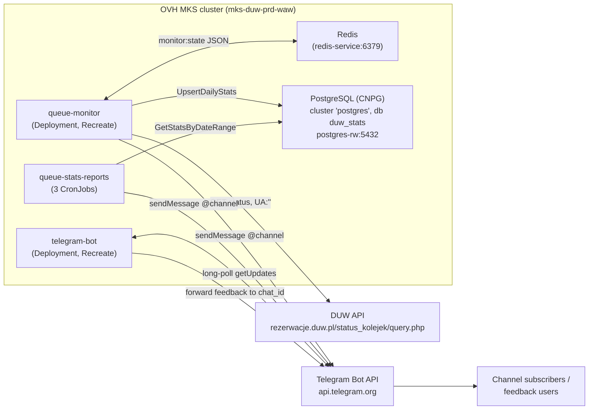
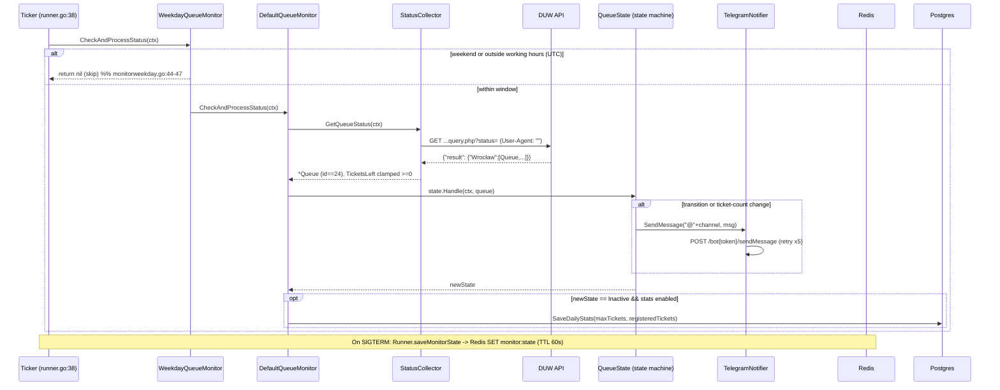

# System overview (L1)

## What it is

A three-service Go system that notifies a Telegram channel when the DUW residence-card queue becomes available, and reports usage statistics. All three binaries live in one Go module (`github.com/uladzk/duw-queue-monitor`) and are built from `cmd/<service>/main.go`. Configuration is entirely environment-variable-driven (`github.com/caarlos0/env/v11`).

| Service | Kind | Entry point | Role |
|---------|------|-------------|------|
| queue-monitor | long-running Deployment | `cmd/queuemonitor/main.go` | Polls DUW API, runs the state machine, posts availability alerts, writes daily stats. |
| telegram-bot | long-running Deployment | `cmd/telegrambot/main.go` | Interactive bot: `/feedback` command, forwards user feedback to an admin chat. |
| queue-stats-reports | CronJob (run-to-completion CLI) | `cmd/queuestatsreports/main.go` | `--period=daily\|weekly\|monthly`; reads Postgres, posts a summary, exits. |

Data stores: **Redis** (queue-monitor state, key `monitor:state`) and **PostgreSQL** via CloudNativePG (table `queue_daily_stats`, written by queue-monitor, read by queue-stats-reports).

## Context diagram

Secrets (bot token, channel name, feedback chat id, Postgres credentials) come from Infisical via External Secrets Operator; see `06-infra.md`.

## One request lifecycle: queue-monitor tick

The dominant flow. `Runner.Run` loops on a ticker (`STATUS_CHECK_INTERVAL_SECONDS`, prd=5s) and calls `CheckAndProcessStatus` each tick after an immediate first check (`runner.go:41`).

Key invariants of this flow:
- The **clock gate runs before the API call** — no DUW request outside the working window (`monitorweekday.go`).
- The state machine emits **at most one notification per tick**, and only on a real change (`state*.go`).
- State is written to Redis **on shutdown only** (`runner.go:53-59`); it is read once at startup (`runner.go:87-105`). It is not written every tick — the in-memory state is authoritative during a run.
- Daily-stats write is a **side effect of the → Inactive transition**, i.e. once per day at end-of-window (`monitor.go:65-67`).

## Where to go next

- Poll loop / state machine / persistence internals → `02-queue-monitor.md`
- Bot handlers → `03-telegram-bot.md`
- Reports & CLI → `04-stats-reports.md`
- Postgres/sqlc, migrations, Redis schema, logger, notifier → `05-data-and-shared.md`
- k8s/terraform/deploy → `06-infra.md`
- CI, Docker, versioning, local run → `07-ci-cd.md`
- Making a change → `08-change-guide.md`
- Symptoms & failure modes → `09-reliability.md`
