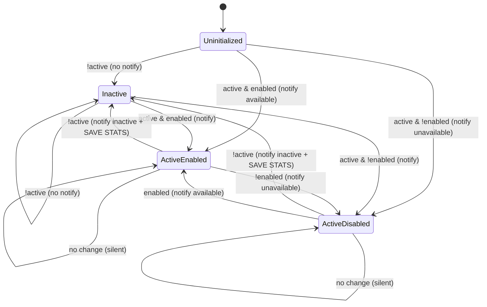

# queue-monitor service (L2)

Long-running Deployment. Package `internal/queuemonitor`, entry `cmd/queuemonitor/main.go`. Polls the DUW API, runs a state machine, posts availability alerts, and (when enabled) writes daily stats.

## Wiring (`cmd/queuemonitor/main.go`)

`buildRunner` (`main.go:70`) is the DI container. Assembly order:
- `http.Client` with `Timeout = MONITOR_HTTP_CLIENT_TIMEOUT_SECONDS` (default 5s) — shared by collector and notifier (`main.go:76`).
- Redis client from `redis.ParseURL(STATE_REDIS_CONNECTION_STRING)` (`main.go:80`).
- `MonitorStateRepository`, `StatusCollector`, `TelegramNotifier`.
- Postgres repo **only if `FF_DAILY_STATS_ENABLED`** — opens `sql.Open("postgres", …)` and `db.Ping()`s at startup; a ping failure aborts boot (`main.go:92-103`). If the flag is off, `statsRepo` stays nil.
- `DefaultQueueMonitor` wrapped by `WeekdayQueueMonitor`, wrapped by `Runner` (`main.go:106-109`).

Graceful shutdown: `signal.NotifyContext(os.Interrupt, syscall.SIGTERM)` (`main.go:31`); `run` blocks on `<-ctx.Done()` then waits for the `done` channel the Runner closes after saving state (`main.go:51-54`).

## Runner loop (`runner.go`)

- `Run` (`runner.go:33`): `initMonitorState` → `time.NewTicker(STATUS_CHECK_INTERVAL_SECONDS)` → immediate `doCheck` (avoids first-tick wait, `runner.go:41`) → `select` on `ctx.Done()` / `ticker.C`.
- `initMonitorState` (`runner.go:87`): `stateRepo.Get`; on nil (no prior state / expired), seeds a default `MonitorState{QueueActive:false,...}` and logs `"No previous monitor state found, initializing with default values"`.
- `saveMonitorState` (`runner.go:69`): uses `context.WithoutCancel(ctx)` so the save survives the cancelled shutdown context (`runner.go:77`). Called only from `doShutdown`.
- A per-tick error is logged (`"Error during collecting status and pushing notifications"`) and swallowed — the loop continues (`runner.go:62-64`).

The `QueueMonitor` interface (`runner.go:18`) is `Init / GetState / CheckAndProcessStatus`; both `DefaultQueueMonitor` and `WeekdayQueueMonitor` implement it.

## StatusCollector — DUW API (`statuscollector.go`)

- Endpoint (default): `STATUS_API_URL = https://rezerwacje.duw.pl/status_kolejek/query.php?status=` (`config.go:18`). Method GET.
- **`req.Header.Set("User-Agent", "")`** — mandatory; DUW returns no data with a default UA (`statuscollector.go:54`). Do not remove.
- Response shape (`statuscollector.go:24-38`):
  ```
  Response { Result map[string][]Queue `json:"result"` }
  Queue { id, name, enabled, active, ticket_value(string), tickets_left, registered_tickets, max_tickets }
  ```
  Match rule: iterate `Result[StatusMonitoredQueueCity]` (default `Wrocław`), return the queue with `id == StatusMonitoredQueueId` (default `24`) (`statuscollector.go:61-62`). Not found → error `"failed to find the queue status for the queue with id: %v"`.
- **Negative `tickets_left` is clamped to 0**, not an error — logs `"DUW API returned negative TicketsLeft, clamping to 0"` (`statuscollector.go:66-72`). This exists because DUW occasionally reports negatives; see `09-reliability.md` (1.5.0 froze on this before the clamp).
- Retry (`getStatusWithRetries`, `statuscollector.go:85`): `avast/retry-go/v4`, `Attempts(STATUS_CHECK_MAX_ATTEMPTS=3)`, `FixedDelay(STATUS_CHECK_ATTEMPT_DELAY_MS=500ms)`, bounded by a `context.WithTimeout(STATUS_CHECK_TIMEOUT_MS=4000ms)`. Retries on transport error, non-200, or JSON decode failure.

## State machine

Interface `QueueState { Handle(ctx, *Queue) (QueueState, error); Name() string; TicketsLeft() int }` (`state.go:9`). Four states, one file each. `DefaultQueueMonitor.CheckAndProcessStatus` (`monitor.go:50`) fetches the queue, calls `state.Handle`, and only logs/acts when `newState.Name() != prevStateName`.



- **Uninitialized** (`stateuninitialized.go`): startup state (also constructed when Redis had nothing). First activation always notifies.
- **Inactive** (`stateinactive.go`): DUW closed. `!active` stays Inactive silently; activation notifies and branches on `enabled`.
- **ActiveEnabled** (`stateactiveenabled.go`): carries `ticketsLeft`. Re-notifies whenever `queue.TicketsLeft != s.ticketsLeft` (`stateactiveenabled.go:31`) — this is the "N tickets left" repeat alert.
- **ActiveDisabled** (`stateactivedisabled.go`): active but no tickets. `TicketsLeft()` returns 0.

The notification text/target is built in `sendNotification` (`notification.go:39`): `chatID = "@"+BroadcastChannelName`; inactive uses `msgQueueInactive`, otherwise `buildQueueAvailableMsg` picks general vs short (short when `ticket_value==""`) vs unavailable (when `!enabled`). Messages are Polish HTML; verbatim templates in `notification.go:10-13`. The empty-`ticket_value` short form is the source of the "morning flood" symptom (`09-reliability.md`).

## Working-hours gate (`monitorweekday.go`)

`WeekdayQueueMonitor` decorates the monitor. `isDuwOffTime` (`monitorweekday.go:52`) returns true (skip, log debug, no API call) when UTC weekday is Sat/Sun **or** `hour < WORKING_HOUR_START_UTC` (5) or `hour >= WORKING_HOUR_END_UTC` (18; prd overlay patches to 17). Rationale in the source comment: DUW reports the queue active on weekends, so the gate is client-side, not API-derived.

## Persistence (`monitorstate.go`)

`MonitorState` (`monitorstate.go:12`): `state_name`, `queue_active`, `queue_enabled`, `last_ticket_processed`, `tickets_left`. Redis key **`monitor:state`** (`monitorstate.go:29`), TTL `STATE_TTL_SECONDS` (default 60s). `state_name` is the source of truth on reload; the booleans are backward-compat and derived if `state_name` is empty (`state.go:26-46`). `StateToPersistence` also snapshots `last_ticket_processed = queue.TicketValue` (`state.go:73`).

Because TTL is 60s and state is saved only on shutdown, a monitor down >60s reloads as if fresh (Uninitialized-equivalent) — acceptable, since the first tick re-derives from the live API.

## Config reference (`config.go`)

| Env var | Default | Required | Notes |
|---------|---------|----------|-------|
| `STATUS_CHECK_INTERVAL_SECONDS` | 10 | | prd=5, dev overlay=120 |
| `NOTIFICATION_TELEGRAM_BROADCAST_CHANNEL_NAME` | — | yes | used as `@name` |
| `FF_DAILY_STATS_ENABLED` | false | | gates Postgres wiring |
| `WORKING_HOUR_START_UTC` | 5 | | |
| `WORKING_HOUR_END_UTC` | 18 | | prd overlay patches to 17 |
| `STATUS_MONITORED_QUEUE_ID` | 24 | | DUW queue id |
| `STATUS_MONITORED_QUEUE_CITY` | Wrocław | | |
| `STATUS_API_URL` | rezerwacje.duw.pl/…status= | | |
| `STATUS_CHECK_TIMEOUT_MS` | 4000 | | overall retry budget |
| `STATUS_CHECK_MAX_ATTEMPTS` | 3 | | |
| `STATUS_CHECK_ATTEMPT_DELAY_MS` | 500 | | fixed delay |
| `MONITOR_HTTP_CLIENT_TIMEOUT_SECONDS` | 5 | | http.Client timeout |
| `STATE_REDIS_CONNECTION_STRING` | — | yes | `redis://…` URL |
| `STATE_TTL_SECONDS` | 60 | | |
| `STATS_POSTGRES_CONNECTION_STRING` | — | (needed if FF on) | |
| `LOG_LEVEL` | info | | shared logger |
| plus `NOTIFICATION_TELEGRAM_*` | see `05-data-and-shared.md` | | |

Note: `USE_TELEGRAM_NOTIFICATIONS=true` appears in the k8s manifests but has **no matching struct field** in `config.go` — it is currently inert (`UNVERIFIED` as intentional; no reader in code).

## Tests

`monitor_test.go` (transition coverage), `monitorweekday_test.go` (clock gating), `monitorstate_integration_test.go` (Redis via `testcontainers-go`).
