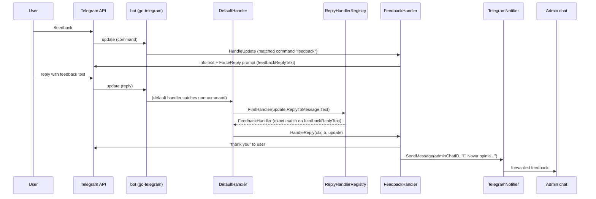

# telegram-bot service (L2)

Long-running Deployment. Package `internal/telegrambot` (+ `handlers/`), entry `cmd/telegrambot/main.go`. An interactive Telegram bot built on `github.com/go-telegram/bot` v1.16.0. Its only user-facing feature today is `/feedback`: it collects anonymous feedback and forwards it to an admin chat. It is independent of queue-monitor (no shared state; different codepath to Telegram).

## Wiring (`cmd/telegrambot/main.go`)

- `buildBotWithHandlers` (`main.go:60`): parse `telegrambot.Config`; build a `TelegramNotifier` (reused for admin forwarding); build `HandlerRegistry(log, notifier, cfg.FeedbackChatID)`; create `bot.New(BotToken, WithDefaultHandler(registry.GetDefaultHandler()))`; `RegisterAllHandlers(bot)`.
- `setProfile` (`main.go:52`): pushes the command list to Telegram via `SetMyCommands` (`profile.go`).
- `go b.Start(ctx)` (`main.go:42`) runs the library's long-poll loop; `<-ctx.Done()` on SIGINT/SIGTERM stops it. Note: the library owns update polling (getUpdates); there is no HTTP server and no exposed port.

The package-level `var log` (`main.go:17`) is set in `main` and used across helpers.

## Handler model (`registry.go`, `handlers/`)

Two registries:
- **`HandlerRegistry`** (`registry.go:38`): maps command name → `Handler`. Seeded with exactly one entry: `"feedback" → handlers.NewFeedbackHandler(...)` (`registry.go:47-49`). `RegisterAllHandlers` calls each handler's `Register(bot, replyRegistry)` (`registry.go:64`). `GetAvailableCommands` builds `[]models.BotCommand` from the map keys, using the command name as **both** command and description (`registry.go:70-78`) — so the menu currently shows `feedback` with description `feedback`.
- **`ReplyHandlerRegistry`** (`registry.go:18`): maps an exact reply-prompt string → `ReplyHandler`. Populated by `RegisterReplyHandler` from each handler's `GetReplyPatterns()`. `FindHandler` is an exact-string map lookup (`registry.go:34`).

`Handler` interface = `Register + HandleUpdate` (`registry.go:13`). `ReplyHandler` interface = `GetReplyPatterns() + HandleReply` (`handlers/replyregistry.go:10`).

## Dispatch flow

Key points:
- The `/feedback` **command** is matched by the library via `b.RegisterHandler(HandlerTypeMessageText, "feedback", MatchTypeCommand, ...)` in `FeedbackHandler.Register` (`handlers/feedback.go`).
- The **reply** is caught by the `DefaultHandler` (registered as the bot's default), which calls `handleReplyMessage` → `replyRegistry.FindHandler(replyText)`. Matching is by the **exact prompt string** the bot sent, `feedbackReplyText = "Aby wysłać opinię, proszę odpowiedz na tę wiadomość swoją opinią:"` (`handlers/feedback.go:16`). Change that string and you must keep the registered pattern in sync or replies stop routing.
- Any message that is neither a known command nor a recognized reply falls through to `sendDefaultMenu` (`handlers/default.go:86`), which renders the command menu (`"Witaj!..."`, `handlers/default.go:14`).

## Admin forwarding target

`FeedbackHandler.adminChatID` is `Config.FeedbackChatID`, from **`NOTIFICATION_TELEGRAM_FEEDBACK_CHAT_ID` (required)** (`config.go:6`). It is passed to `TelegramNotifier.SendMessage` **verbatim** (no `@` prefix) — so this must be a numeric chat id, unlike the queue-monitor broadcast which prefixes `@channel`. Admin message template: `"💬 <b>Nowa opinia od użytkownika</b>\n\n📝 Treść:\n%s"` (`handlers/feedback.go`).

## Config (`config.go`)

| Env var | Required | Notes |
|---------|----------|-------|
| `NOTIFICATION_TELEGRAM_FEEDBACK_CHAT_ID` | yes | admin chat id (numeric, no `@`) |
| `NOTIFICATION_TELEGRAM_BOT_TOKEN` | yes | via embedded `notifications.TelegramConfig` |
| other `NOTIFICATION_TELEGRAM_*` | | see `05-data-and-shared.md` |
| `LOG_LEVEL` | | shared logger |

`USE_TELEGRAM_NOTIFICATIONS=true` is set on the Deployment but has no code reader (inert; same as queue-monitor).

## Tests

`handlers/feedback_test.go`, `handlers/default_test.go`, `registry_test.go`.
