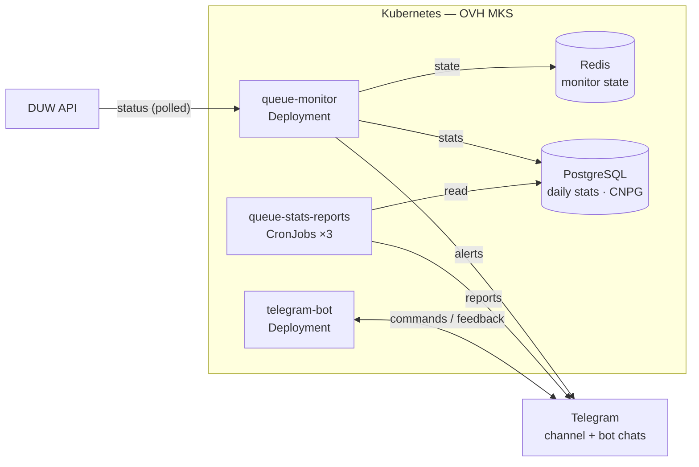
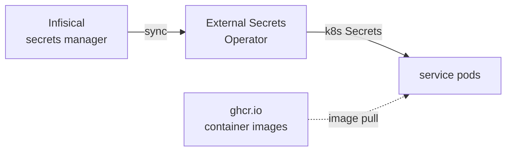
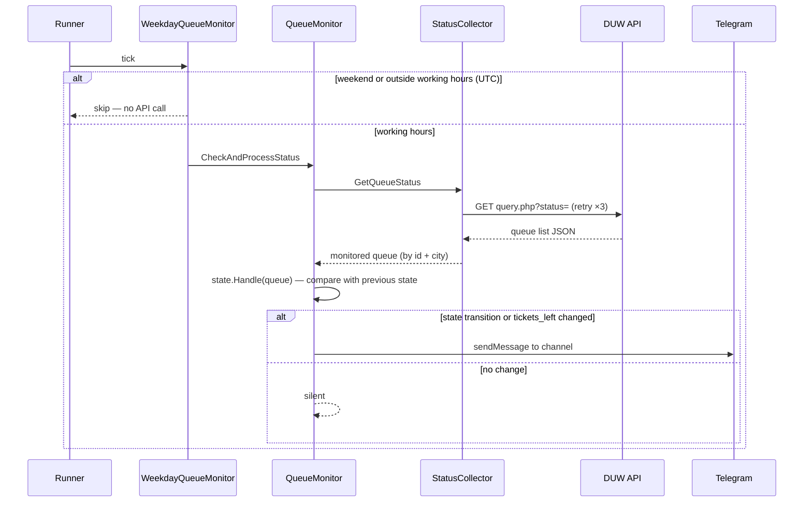
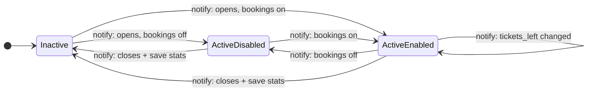
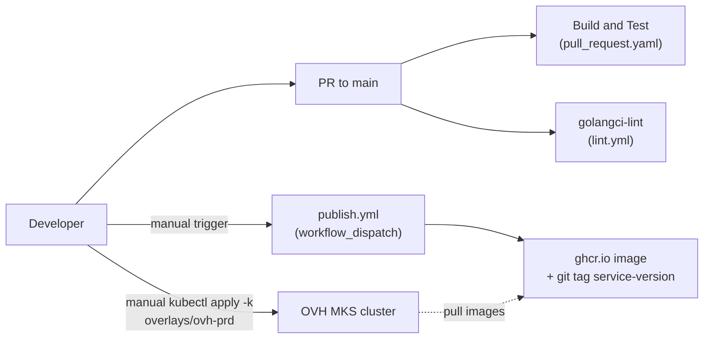

# Architecture

DUW Queue Monitor watches the appointment queue at Dolnośląski Urząd Wojewódzki (DUW) and posts real-time Telegram notifications when slots open. Three Go services share one module and run on OVH Managed Kubernetes.

This is the short, human-facing view. For the exhaustive, commit-pinned reference with `path:line` anchors, see the [code map](agents/map/_map.md).

## System overview

Supporting platform flows — secrets and images:

## Queue check — one tick

The monitor polls on a fixed interval (`STATUS_CHECK_INTERVAL_SECONDS`). A client-side gate skips weekends and hours outside `WORKING_HOUR_START_UTC`–`WORKING_HOUR_END_UTC`, because the DUW API reports the queue as active even when the office is closed.

Monitor state is persisted to Redis (key `monitor:state`) on shutdown so a restart resumes without duplicate notifications.

## Monitor state machine

Notifications fire only on state changes — never on a repeated identical state. Transitions labeled `notify:` emit a channel message; staying `Inactive` is silent.

Startup actually passes through an `Uninitialized` state that behaves like `Inactive`, so a monitor restarted mid-day notifies about an already-open queue. Daily statistics are written to PostgreSQL on the active→inactive transition (end of the office day), gated by the `FF_DAILY_STATS_ENABLED` feature flag.

## CI/CD and deployment

CI validates every PR; image publishing and cluster deployment are separate, manual steps — there is no continuous deployment.

Kubernetes manifests are Kustomize-managed (`infra/k8s/`: shared base + per-cloud/per-env overlays); cluster infrastructure is Terraform-managed (`infra/terraform/ovh/`). Secrets flow from Infisical into the cluster via External Secrets Operator — nothing secret lives in the repo.
